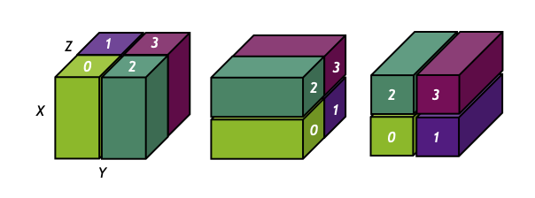

Overview
========

What is cuDecomp?
-----------------
cuDecomp is a library for managing 1D (slab) and 2D (pencil) parallel decompositions of
3D Cartesian spatial domains on NVIDIA GPUs, with routines to perform global transpositions and halo communication.
The library is inspired by the `2DECOMP&FFT Fortran library <https://github.com/xcompact3d/2decomp-fft>`_ , a popular
decomposition library for numerical simulation codes, with a similar set of available transposition routines.
While 2DECOMP&FFT and similar libraries in the past have been written to target CPU systems, this
library is designed for GPU systems, leveraging CUDA-aware MPI and additional communication
libraries optimized for GPUs, like the `NVIDIA Collective Communication Library (NCCL) <https://github.com/NVIDIA/nccl>`_ and
`NVIDIA OpenSHMEM Library (NVSHMEM) <https://developer.nvidia.com/nvshmem>`_.  

It is typical for modern GPU systems to have a hierarchy of connections between peer GPUs with wide-ranging bandwidths,
from fast P2P connections through NVLINK/NVSWITCH between GPUs within a single compute node, to relatively slower
inter-node network connections via Infiniband or Ethernet. Multi-socket nodes can also introduce cross-socket CPU connections
where direct NVLINK connections are not available between GPUs. As a user, it can be challenging to navigate these
various topologies and choose an appropriate decomposition of the domain to optimize network performance for their
workload. To add to this complexity, there are numerous communication libraries available for GPUs to choose from,
with performance characteristics for GPUs varying based on these system topologies, scale, message sizes (and for MPI,
the particular implementation used). To address this challenge, cuDecomp has a runtime autotuning feature that can
sweep across possible domain decompositions and several communication backends using different communication
libraries to find the option that minimizes either the transposition or halo communication time. For applications
that require global transpositions (e.g., FFT-based solvers, ADI solvers), the time to transpose the domain is generally
a large bottleneck, so minimizing this time is often key to ensuring good solver performance. Using autotuning, cuDecomp can
assist users in maintaining high computational performance across problem sizes and clusters. See the autotuning section [link]
for more information on this feature. 

Decomposition Layout
----------------------------
cuDecomp can distribute 3D Cartesian domains with dimensions :math:`[X, Y, Z]`, in column-major order, which we will call 
the *global grid*. The global grid is decomposed
across :math:`N_{\text{GPU}}` processes in a 2D **process grid** with dimensions :math:`P_{\text{row}} \times P_{\text{col}}`. The processes
are logically grouped by column and row index into :math:`P_{\text{row}}` *row* communicators and :math:`P_{\text{col}}` *column* communicators.
For consistency with :code:`MPI_Cart_*` routines, the ranks are assigned in a row-major ordering (i.e. row communicators
are composed of sequential ranks).

cuDecomp will distribute the global domain data so that each process is assigned a unique *pencil* of data, with three different
pencil configurations corresponding to different transposed configurations of the global domain. The domain can be
decomposed into :math:`X`-axis aligned pencils (:math:`X`-pencils), where the :math:`Y` and :math:`Z` dimensions are split across
the process grid,
:math:`Y`-axis aligned pencils (:math:`Y`-pencils), where the :math:`X` and :math:`Z` dimensions are split across the process grid,
or :math:`Z`-axis aligned pencils
(:math:`Z`-pencils), where the :math:`X` and :math:`Y` dimensions are split across the process grid. The shapes of these pencils are approximately:

.. list-table::
  :align: center

  * - :math:`X`-pencils
    - :math:`[X, \; Y/P_{\text{row}}, \; Z/P_{\text{col}}]`
  * - :math:`Y`-pencils
    - :math:`[X/P_{\text{row}}, \; Y, \; Z/P_{\text{col}}]`
  * - :math:`Z`-pencils
    - :math:`[X/P_{\text{row}}, \; Y/P_{\text{col}}, \; Z]`

In the case where the global dimension is not evenly divisible by :math:`P_{\text{row}}` or :math:`P_{\text{col}}` in the formulas
above, the remainder is distributed across the row or column ranks starting from the lowest indexed rank.

A simple illustration of the decomposition using a :math:`2 \times 2` process grid is shown below. From left to right, the illustration
shows the :math:`X`-pencil, :math:`Y`-pencil, and :math:`Z`-pencil configurations, with associated rank assignments.  

