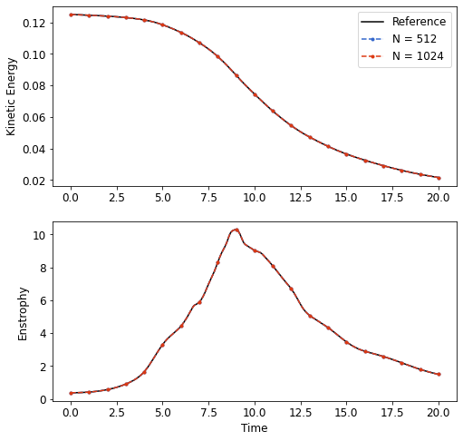

# Taylor-Green Vortex Solver
In this sub-directory, there is an example spectral incompressible CFD solver for the Taylor-Green vortex problem
written in CUDA. The solver is based on an implementation presented by Mortensen and Langtangen ([paper](https://arxiv.org/abs/1602.03638)).
This example uses cuDecomp to perform global transposes required for distributed FFT computations, with
full autotuning enabled to select a process grid and communication backend to minimize transpose communication.

An example of how to launch this solver on a DGX A100 system with 8 GPUs is:
```
mpirun -np 8 --mca pml ucx --bind-to none \
../../../utils/bind.sh --cpu=../../../utils/dgxa100_map.sh --mem=../../../utils/dgxa100_map.sh -- \
./tg -n 512 -i 20000
```
This command will run the solver on a 512^3 grid for 20000 steps (or 20 units of flow time). Run `./tg -h` to see available
options for this solver.

## Comparison with reference data
In the [`data`](data) directory, we include results obtained on a DGX A100 system for a 512^3 grid
([`tg_n512_output.txt`](data/tg_n512_output.txt)) and 1024^3 grid ([`tg_n1024_output.txt`](data/tg_n1024_output.txt) for this problem. Below is a plot comparing these results to those obtained by van Rees et al., a commonly used reference for this problem ([paper](https://scholar.harvard.edu/files/wimvanrees/files/rees2011.pdf)).


